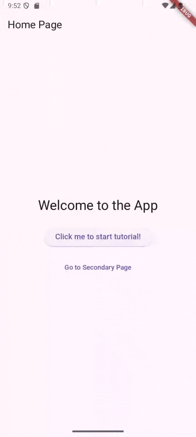

# tutorial_overlay

tutorial_overlay is a Flutter package that makes it easy to create interactive, step-by-step tutorials in your app. It overlays highlights on specific widgets and guides users with custom tooltips and indicators, perfect for onboarding or feature discovery.

## ✨ Features
- Step-by-Step Guidance: Highlight widgets and walk users through your app.
- Custom Tooltips: Add any widget (text, buttons, images, etc.) to explain each step.
- Custom Indicators: Use arrows or icons to point users to the right spot.
- Multi-Page Support: Keep the tutorial flowing across different screens.

## Example
```bash
git clone https://github.com/xinyi-chong/tutorial_overlay.git
cd tutorial_overlay/example
flutter run
```

## Screenshots & Demonstrations

Here are some examples showcasing the features of `tutorial_overlay`:

<table>
  <tr>
    <th>
      Tutorial Across Pages
    </th>
    <th>
      Update Support
    </th>
    <th>
      Custom Indicator
    </th>
    <th>
      Tutorial Without Target Widget
    </th>
  </tr>
  <tr>
    <td align="center">
       <br/>
      <em>Steps across multiple pages.</em>
    </td>
    <td align="center">
       <br/>
      <em>E.g. Updates on language change.</em>
    </td>
    <td align="center">
      
    </td>
    <td align="center">
      
    </td>
  </tr>
</table>


## Getting started

# Installation
Add tutorial_overlay to your pubspec.yaml:
```yaml
dependencies:
    tutorial_overlay: ^<latest_version>
```

Run: 
```bash
flutter pub get
```

Check the [pub.dev page](https://pub.dev/packages/tutorial_overlay) for the latest version.

## Usage

1. Use a GlobalKey to mark the widget you want to highlight (e.g., a button):
```dart
final helpButtonKey = GlobalKey();

IconButton(
    key: helpButtonKey,
    onPressed: () {
      tutorial.startTutorial('home');
    },
    icon: Icon(Icons.help),
)
```

2. Define Tutorial Steps and wrap your app with the tutorial provider:
```dart


void main() {
  final tutorial = Tutorial<String>({
    'home': [
      TutorialStep(
        widgetKey: helpButtonKey,
        child: const Text('Tap here to get help'),
      ),
    ],
  });

  runApp(tutorial.provide(const MyApp()));
}
```

3. Wrap your page with **TutorialOverlay**, specifying the tutorialId:
```dart
class MyApp extends StatelessWidget {
  const MyApp({super.key});

  @override
  Widget build(BuildContext context) {
    return MaterialApp(
      home: TutorialOverlay<String>(
        tutorialId: 'home',  // Matches the key in the tutorial map
        child: const MyHomePage(),
      ),
    );
  }
}
```

4. Control the Tutorial
```dart
  tutorial.startTutorial('home');
  tutorial.nextStep('home');
  tutorial.previousStep('home');
  tutorial.endTutorial('home');
```

**Navigation**: To move between pages, use:
```dart
tutorial.nextStep('home', route: '/your-page', context: context); // Navigate to a new route
tutorial.previousStep('home', backToPreviousPage: true, context: context); // Go back
```

5. Updating Tutorial
You can dynamically update the tutorials after initialization by using updateTutorial:
```dart
  tutorial.updateTutorial(newTutorial);
```
