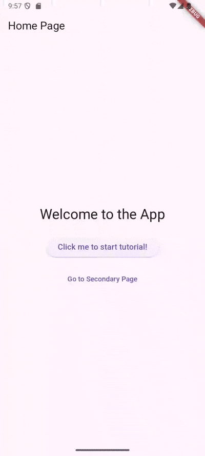

# tutorial_overlay

`tutorial_overlay` is a Flutter package for building interactive, step-by-step tutorials that highlight and point to widgets across multiple screens with customizable indicators.

## ✨ Key Features
- **Cross-Screen & Multi-Step Guidance**: Guide users through your app’s features across multiple screens.
- **Widget Highlighting**: Visually emphasize specific UI elements with customizable indicators
- **Customizable UI**: Match tutorials to your app’s style by customizing tooltips with any widget (text, buttons, images) and indicators like arrows or shapes with your choice of colors and sizes.

## 🎮 Live Demo
Explore the interactive example:
```bash
git clone https://github.com/xinyi-chong/tutorial_overlay.git
cd tutorial_overlay/example
flutter run
```

## 📸 Showcase

Here are some examples showcasing the features of `tutorial_overlay`:

<table>
  <tr>
    <th>
      Tutorial Across Pages
    </th>
    <th>
      Dynamic Updates
    </th>
    <th>
      Custom Indicator
    </th>
    <th>
      Tutorial without Target Widget
    </th>
  </tr>
  <tr>
    <td align="center">
       <br/>
      <em>Guides users through multiple app screens.</em>
    </td>
    <td align="center">
       <br/>
      <em>Updates content, e.g., for language changes.</em>
    </td>
    <td align="center">
      
      <em>Uses a custom arrow to highlight a widget.</em>
    </td>
    <td align="center">
      
      <em>Shows instructions without highlighting a widget.</em>
    </td>
  </tr>
</table>

## 🚀 Getting started

### Installation

[](https://pub.dev/packages/tutorial_overlay)

Add `tutorial_overlay` to your `pubspec.yaml` and fetch the package:
```yaml
dependencies:
    tutorial_overlay: ^<latest_version>
```
```bash
flutter pub get
```

Or install directly:
```bash
flutter pub add tutorial_overlay
```

### Import
```dart
import 'package:tutorial_overlay/tutorial_overlay.dart';
```

## 🛠 How To Use

### 1. Set Up Tutorial

Create a `Tutorial` instance to define steps, using a unique `tutorialId` (e.g., `'home'`) to organize tutorials for different app sections (e.g., `'home'` for onboarding, `'profile'` for profile setup). You can customize individual steps with styles (e.g., `indicator`) to override defaults set in `TutorialOverlay` (next step). Wrap your app with the tutorial provider to enable tutorials.

**Highlight a Widget (Optional)**

If you want to highlight a specific widget during the tutorial (e.g., a button or text), assign a `GlobalKey` to it. This key uniquely identifies the widget for the tutorial to target. Skip this step for steps that don’t highlight a widget:

```dart
final widgetToHighlightKey = GlobalKey();

Text(
    key: widgetToHighlightKey,
    'This text will be highlighted in the tutorial',
)
```

**Set Up Tutorial**

Create a `Tutorial` with steps for each `tutorialId`. Wrap your app with `Tutorial.provide`:

```dart
void main() {
  final tutorial = Tutorial<String>({
    'home': [ // Tutorial for the home screen
      TutorialStep(
        widgetKey: widgetToHighlightKey, // Highlights a specific widget
        child: Column(
          children: [
            const Text('Welcome to the app! This highlights a key feature.'),
            ElevatedButton(
              onPressed: () => tutorial.nextStep('home'),
              child: const Text('Next'),
            ),
          ],
        ),
      ),
      TutorialStep( // No widgetKey: shows general instructions
        child: Column(
          children: [
            const Text('The tutorial has ended.'),
            ElevatedButton(
              onPressed: () => tutorial.endTutorial('home'),
              child: const Text('Close'),
            ),
          ],
        ),
      ),
    ],
    'profile': [ // Tutorial for the profile screen
      TutorialStep(
        child: Column(
          children: [
            Text('Set up your profile.'),
            ElevatedButton(
              onPressed: () => tutorial.endTutorial('profile'),
              child: Text('Close'),
            ),
          ],
        ),
      ),
    ],
  });

  runApp(Tutorial.provide(tutorial: tutorial, child: const MyApp()));
}
```

### 2. Wrap Pages with TutorialOverlay

Wrap each page with `TutorialOverlay` and specify the `tutorialId` that matches the tutorial defined in the `Tutorial` instance. Set the required tooltip `width` and optionally define default styling (e.g., `indicator, `padding), which apply unless overridden in a `TutorialStep`:

```dart
class MyApp extends StatelessWidget {
  const MyApp({super.key});

  @override
  Widget build(BuildContext context) {
    return MaterialApp(
      home: TutorialOverlay<String>(
        tutorialId: 'home',  // Matches the `home` key in the tutorial map
        // Default styling for all steps in this overlay
        width: 320,  // Required
        dismissOnTap: false,
        padding: EdgeInsets.all(20),
        indicator: Icon(Icons.star, size: 24),  // Default indicator
        indicatorHeight: 24, // Required with indicator for tooltip positioning
        indicatorWidth: 24,  // Required with indicator for tooltip positioning
        child: const MyHomePage(),
      ),
    );
  }
}
```

### 3. Control the Tutorial

Use these methods to manage the tutorial flow:

```dart
tutorial.startTutorial('home'); // Start the 'home' tutorial
tutorial.nextStep('home');      // Move to the next step; ends if last step
tutorial.previousStep('home');  // Move to the previous step
tutorial.endTutorial('home');   // End the 'home' tutorial
```

#### Handle Navigation

To navigate between pages during the tutorial, provide the `context` for routing:

```dart
// Navigate to a new route
tutorial.nextStep('home', route: '/your-page', context: context);
// Go back to the previous page
tutorial.previousStep('home', backToPreviousPage: true, context: context);
```

### 4. Update Tutorials Dynamically

Modify tutorials after initialization, e.g., for language changes:

```dart
// Define a function to build or update tutorials
Map<String, List<TutorialStep>> buildTutorials(String language) {
  return {
    'home': [
      TutorialStep(
        child: Column(
          children: [
            Text(language == 'en' ? 'Welcome!' : '欢迎！'),
            ElevatedButton(
              onPressed: () => tutorial.endTutorial('home'),
              child: const Text('Close'),
            ),
          ],
        ),
      ),
    ],
  };
}

// Initialize and update the tutorial
void main() {
  final tutorial = Tutorial<String>(buildTutorials('en')); // Initial tutorial in English
  runApp(Tutorial.provide(tutorial: tutorial, child: const MyApp()));

  // Example: Update tutorial for Chinese
  tutorial.updateTutorial(buildTutorials('zh'));
}
```

### 5. Properties & Styling

Set **default styles** in `TutorialOverlay` to apply to all steps, and override them in `TutorialStep` for individual steps.

#### `TutorialOverlay`: Default Styling

<table>
    <tr>
      <th>Property</th>
      <th>Type</th>
      <th>Description</th>
      <th>Default Value</th>
    </tr>
    <tr>
      <td><code>child</code></td>
      <td><code>Widget</code></td>
      <td>Screen content to overlay. Required.</td>
      <td>None (required)</td>
    </tr>
    <tr>
      <td><code>tutorialId</code></td>
      <td><code>T</code></td>
      <td>A unique identifier for the tutorial. Required.</td>
      <td>None (required)</td>
    </tr>
    <tr>
      <td><code>width</code></td>
      <td><code>double</code></td>
      <td>Tooltip container width. Required.</td>
      <td>None (required)</td>
    </tr>
    <tr>
      <td><code>height</code></td>
      <td><code>double?</code></td>
      <td>Optional tooltip container height.</td>
      <td><code>null</code></td>
    </tr>
    <tr>
      <td><code>decoration</code></td>
      <td><code>Decoration?</code></td>
      <td>Optional tooltip decoration.</td>
      <td><code>null</code></td>
    </tr>
    <tr>
      <td><code>padding</code></td>
      <td><code>EdgeInsetsGeometry?</code></td>
      <td>Optional tooltip content padding.</td>
      <td><code>null</code></td>
    </tr>
    <tr>
      <td><code>dismissOnTap</code></td>
      <td><code>bool</code></td>
      <td>End tutorial on tap outside tooltip.</td>
      <td><code>true</code></td>
    </tr>
    <tr>
      <td><code>indicator</code></td>
      <td><code>Widget?</code></td>
      <td>Default indicator widget to point at the target widget. Set <code>indicatorHeight</code> and <code>indicatorWidth</code> for tooltip positioning.</td>
      <td><code>null</code></td>
    </tr>
    <tr>
      <td><code>indicatorHeight</code></td>
      <td><code>double?</code></td>
      <td>Default indicator height, required if <code>indicator</code> is set.</td>
      <td><code>null</code></td>
    </tr>
    <tr>
      <td><code>indicatorWidth</code></td>
      <td><code>double?</code></td>
      <td>Default indicator width, required if <code>indicator</code> is set.</td>
      <td><code>null</code></td>
    </tr>
    <tr>
      <td><code>overlayColor</code></td>
      <td><code>Color</code></td>
      <td>Overlay color outside the target widget.</td>
      <td><code>Colors.black54</code></td>
    </tr>
    <tr>
      <td><code>radius</code></td>
      <td><code>double</code></td>
      <td>Corner radius of the highlight area around the target widget.</td>
      <td><code>4</code></td>
    </tr>
    <tr>
      <td><code>focusOverlayPadding</code></td>
      <td><code>EdgeInsets?</code></td>
      <td>Optional padding for the highlighted area around the target widget.</td>
      <td><code>null</code></td>
    </tr>
  </table>

#### `TutorialStep`: Custom Styling for Individual Steps

<table>
    <tr>
      <th>Property</th>
      <th>Type</th>
      <th>Description</th>
      <th>Default Value</th>
    </tr>
    <tr>
      <td><code>child</code></td>
      <td><code>Widget</code></td>
      <td>Tooltip content. Required.</td>
      <td>None (required)</td>
    </tr>
    <tr>
      <td><code>widgetKey</code></td>
      <td><code>GlobalKey?</code></td>
      <td>Key of the widget to highlight.</td>
      <td><code>null</code></td>
    </tr>
    <tr>
      <td><code>showAbove</code></td>
      <td><code>Decoration?</code></td>
      <td>Show tooltip above (true) or below (false) the target. Auto determined if null.</td>
      <td><code>null</code></td>
    </tr>
    <tr>
      <td><code>indicator</code></td>
      <td><code>Widget?</code></td>
      <td>Override <code>TutorialOverlay.indicator</code>. Set <code>indicatorHeight</code> and <code>indicatorWidth</code> for tooltip positioning.</td>
      <td><code>null</code></td>
    </tr>
    <tr>
      <td><code>indicatorHeight</code></td>
      <td><code>double?</code></td>
      <td>Override <code>TutorialOverlay.indicatorHeight</code>, required if <code>indicator</code> is set.</td>
      <td><code>null</code></td>
    </tr>
    <tr>
      <td><code>indicatorWidth</code></td>
      <td><code>double?</code></td>
      <td>Override <code>TutorialOverlay.indicatorWidth</code>, required if <code>indicator</code> is set.</td>
      <td><code>null</code></td>
    </tr>
    <tr>
      <td><code>focusOverlayPadding</code></td>
      <td><code>EdgeInsets?</code></td>
      <td>Optional padding for the highlighted area around the target widget.</td>
      <td><code>null</code></td>
    </tr>
  </table>

For a complete list of all classes' properties and methods, refer to the [API documentation](https://pub.dev/documentation/tutorial_overlay/latest/tutorial_overlay/) on pub.dev.


## 📋 Additional Notes
- Ensure `GlobalKey` is unique for each widget to avoid conflicts.
- Provide `context` for navigation to ensure proper routing in multi-screen tutorials.
- Use distinct `tutorialId` values (e.g., `'home'`, `'profile'`) to manage multiple tutorials within the same app.
  
For more details, refer to the [example folder](https://github.com/xinyi-chong/tutorial_overlay/tree/main/example) in the repository.

### Troubleshooting
- **Tutorial not showing**: Ensure `tutorialId` matches between `Tutorial` and `TutorialOverlay`.
- **Widget not highlighted**: Verify the `GlobalKey` is attached to a rendered widget.
- **Navigation errors**: Confirm the `context` is from the correct navigator.

🐛 Report bugs or request features via [Issues](https://github.com/xinyi-chong/tutorial_overlay/issues).
